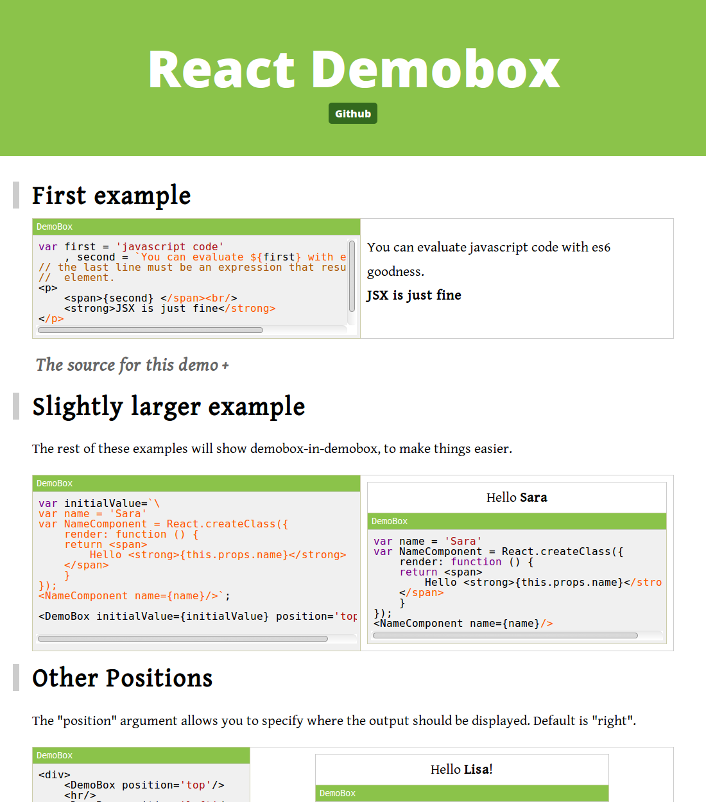

<!--
---
title: Demobox
subtitle: Demo Page Generator
fontPair: Open Sans
colors: light-green
links:
  Home: index.html
  Demos: demo.html
  Themes: themes.html
  Github: https://github.com/jaredly/demobox

demobox:
- style-min-width: "300px"
---
-->

There are three ways to use demobox, for varying simplicity and flexibility.

1. [demo page generator](#demo-page-generator)
2. [drop-in script](#the-demoboxjs-drop-in-script)
3. [react component](#as-a-react-component)

# Demo Page Generator

The `demobox` cli tool will turn a regular markdown file with annotated code
snippets into a stylish demo page with editable examples. You can look at the
markdown source for this page
[here](https://github.com/jaredly/demobox/blob/master/Readme.md) as an
example. Also the source for the demo page
([demo.md](https://github.com/jaredly/demobox/blob/master/demo.md))
showcases a number of features.

```bash
$ npm install -g demobox
$ demobox -i demo.md -o demo.html
```

## `demo.md` (||)

```markdown

---
title: Demobox Demos
subtitle: Getting rather meta
fontPair: Open Sans
colors: light-green
links:
  Home: index.html
  Demos: demos.html
  Themes: themes.html
  Github: https://github.com/jaredly/demobox
---

# First example

``ˋjavascript
// @demobox height=150px
var first = 'javascript code'
  , second = `You can evaluate ${first} with es6 goodness.`;
// the last line must be an expression that results in a react
//  element.
<p>
  <span>{second} </span><br/>
  <strong>JSX is just fine</strong>
</p>
``ˋ

... etc.
```

## `demo.html` rendered page (||)

[](demo.html)

## Configuration

- **title:** the title of the page (default: Demo Page)
- **subtitle:** the subtitle (default: none)
- **links:** a map of title:href for links displayed in the header
- **styles:** a list of css files to include on the page
- **scripts:** a list of js files to include
- **extraHead:** a list of html files to inject at the end of the head
- **bodyTop:** a list of html files to inject at the top of the body

### Themes

There are two configuration options associated with theming, `colors` and
`fontPair`. Look at the [themes page](themes.html) for examples and more
information.

## Special Headings

There are a few suffixes you can put onto headings that will give them extra
properties (See the [markdown source](https://github.com/jaredly/demobox/blob/master/Readme.md) of this page for an example).

- `(<<)` marks the section as collapsed
- `(>>)` marks the section as collapsible but expanded
- `(||)` makes the section part of a column group. Adjascent sections (of the
    same heading level) that have this marking will be rendered side-by-side.
    An example of this is the `demo.md` and "`demo.html` rendered page"
    sections above.


# The `demobox.js` drop-in script

### Included in the `<head>`

```html
<!-- if you want codemirror, that needs to be included separately -->
<script src="https://jaredly.github.io/demobox/demobox.js"></script>
<link rel="stylesheet" href="https://jaredly.github.io/demobox/demobox.css">
```

### Markup in the page

```html
<textarea data-demobox>
// some great code here
var x = <em>element</em>;

<strong>End with a react {x}</strong>
</textarea>
```

### Rendered as a demobox

The `demobox.js` script finds all `textarea`s with the `data-demobox`
attribute and converts them into demoboxes that look like this:

```jsx
// @demobox
// some great code here
var x = <em>element</em>;

<strong>End with a react {x}</strong>
```

Configuration options can be given as `data-*` attributes on the textarea.
Look at the html source of this page (and [the demo page](demo.html)) for example usage.

# As a react component

If you install the `demobox` library from npm (`npm install -S demobox`) then
you can use the `DemoBox` react component in your project.

In this demobox, you can play with the `DemoBox` component :).

```jsx
// @demobox
var value = `\
<strong>
  It's demoboxes all the way down...
</strong>
`;

// Try changing position to left, right
// or top, and codeMirror to false
<DemoBox
    position='bottom'
    header={true}
    style={{width: 360}}
    codeMirror={true}
    initialValue={value}/>
```

